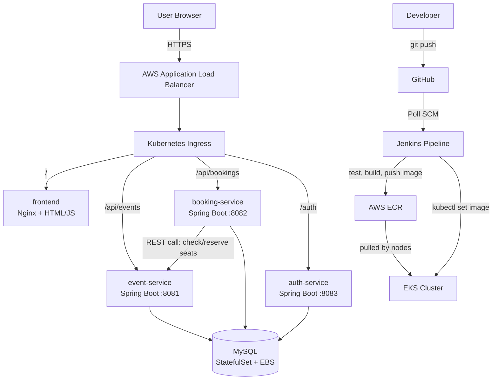

# Ticket Booking System

A cloud-native microservices ticket booking platform, built end-to-end as a portfolio project to apply DevOps and cloud engineering concepts in practice — from local development through full CI/CD and production-grade Kubernetes deployment on AWS.

## Architecture



**Flow:** a developer pushes code → Jenkins detects the change, runs tests, builds a Docker image, and pushes it to ECR → Jenkins tells the running EKS Deployment to roll out the new image → Kubernetes handles the update with zero downtime, and the live app — reachable through a public AWS Load Balancer — is running the new version.

## Tech Stack

| Layer | Technology |
|---|---|
| Backend | Java 21, Spring Boot 4, Spring Data JPA, Spring Security (JWT) |
| Database | MySQL 8 |
| Frontend | HTML, vanilla JS, Nginx |
| Containerization | Docker (multi-stage builds) |
| CI/CD | Jenkins (declarative pipelines) |
| Container Registry | AWS ECR |
| Orchestration | Kubernetes (Amazon EKS) |
| Networking | AWS ALB via Kubernetes Ingress (aws-load-balancer-controller) |
| Config/Secrets | Kubernetes ConfigMap / Secret |
| Autoscaling & Health | Horizontal Pod Autoscaler, liveness/readiness probes |
| Provisioning | Ansible (Jenkins server setup), eksctl (EKS cluster setup) |

## Repositories

This is a multi-repo project — each service is independently developed, tested, containerized, and deployed:

- [`ticket-event-service`](https://github.com/agha177/ticket-event-service) — event CRUD API
- [`ticket-booking-service`](https://github.com/agha177/ticket-booking-service) — booking logic, calls event-service to check/reserve seats
- [`ticket-auth-service`](https://github.com/agha177/ticket-auth-service) — registration, login, JWT issuance
- [`ticket-frontend`](https://github.com/agha177/ticket-frontend) — the web UI
- `ticket-infra` (this repo) — Kubernetes manifests, Ansible playbooks, and setup/teardown scripts

## Running Locally

**Option 1 — Docker Compose** (single machine, fastest way to see it running):
```bash
cd ticket-infra
docker compose up -d
```

**Option 2 — Kubernetes (minikube)**:
```bash
minikube start
kubectl apply -f k8s/
```

## Deploying to AWS (EKS)

```bash
cd ticket-infra/scripts
./setup-eks-cluster.sh      # creates the cluster, storage, and deploys the app (~20 min)
./setup-alb-controller.sh   # sets up real internet-facing access via AWS ALB
```

When you're done testing, tear it down to avoid ongoing AWS charges:
```bash
./teardown-eks-cluster.sh
```

## Provisioning the Jenkins Server

```bash
cd ticket-infra/ansible
ansible-playbook -i inventory.ini setup-jenkins.yml
ansible-playbook -i inventory.ini setup-tools.yml
```

These playbooks are idempotent — safe to run repeatedly, and will detect/fix drift (e.g. a tool that went missing) without re-doing work that's already correct.

## CI/CD Pipeline

Each service has its own Jenkins pipeline (`Jenkinsfile` in its repo):
1. **Checkout** — pull latest code from GitHub
2. **Test** — run unit tests
3. **Build** — compile and package into a Docker image
4. **Push to ECR** — tag and push the image
5. **Deploy** — `kubectl set image` tells the live EKS Deployment to roll out the new version, with Kubernetes handling the actual rolling update, health checks, and rollback if it fails

Builds trigger automatically via Poll SCM (the Jenkins server has a private IP, so GitHub webhooks aren't reachable — polling is the practical alternative).

## Known Limitations & Next Steps

This project was built iteratively, and a few gaps are intentionally left as documented next steps rather than blockers:

- **No real unit tests yet** — only the placeholder Spring Initializr test exists; the Jenkins `Test` stage runs but isn't meaningfully testing business logic yet.
- **No admin UI for creating events** — a `seed-events.ps1` script populates demo data instead; deliberate scope decision to prioritize infrastructure work.
- **Auth is not yet enforced across services** — `auth-service` issues JWTs, but `event-service` and `booking-service` don't currently validate them. A full implementation would add a Spring Security filter chain to protect those endpoints.
- **CORS is wide open** (`allowedOrigins("*")`) — fine for local development, would be scoped down for a real deployment.
- **Secrets are base64-encoded, not encrypted** — Kubernetes Secrets are base64 by default, which is encoding, not encryption. A production setup would use a real secrets manager (AWS Secrets Manager, Sealed Secrets, etc.).
- **Jenkins builds share a single Docker daemon** — if multiple builds overlap (e.g. several rapid commits), the mutable `:latest` image tag can briefly point to the wrong build's image, since concurrent builds can overwrite each other's local tag. Deployments themselves are unaffected, since they always reference the exact, immutable build-number tag — never `:latest`.
- **Infrastructure is provisioned via `eksctl`, not Terraform** — a deliberate choice to move quickly with a tool already suited to EKS; migrating this to Terraform is a planned next step to build proper Infrastructure-as-Code skills.
- **No centralized monitoring/observability yet** — Prometheus and Grafana are planned for a future iteration.

## What This Project Demonstrates

- Building and containerizing a multi-service Spring Boot application
- Writing and debugging real CI/CD pipelines (Jenkins declarative pipelines)
- Kubernetes fundamentals: Deployments, Services, StatefulSets, ConfigMaps/Secrets, Ingress, HPA, health probes
- Real AWS infrastructure: EKS, ECR, IAM (least-privilege service accounts, IRSA), VPC networking, Application Load Balancers
- Infrastructure automation with Ansible (idempotent, tested playbooks)
- Debugging real-world issues across the stack — Docker networking, Kubernetes storage provisioning, IAM permission chains, and CI/CD concurrency
